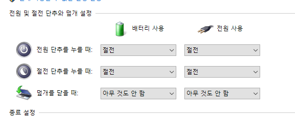

## Introduction

<br>

- Laptop은 기본적으로 덮개를 닫을 시 절전모드로 들어가게 설정이 되어있다.
- 덮개를 닫을 시 절전모드 진입을 방지하기 위해 아래의 방법을 사용할 수 있다.

<br>

## 1. 제어판 옵션을 통한 변경

<br>

1. 설정 - 시스템 - 전원 및 절전 클릭
    
2. 화면 우측의 `추가 전원 설정` 클릭
    
3. `덮개를 닫으면 수행되는 작업 선택` 클릭
    
4. `덮개를 닫을 때` 옵션을 `아무 것도 안 함`으로 변경
    

<br>

## 2. Command prompt 명령어 사용

<br>

1. 아래의 두 명령어를 Command prompt에 입력해준다.
    - `powercfg /setacvalueindex scheme_current sub_buttons lidaction 0`
    - `powercfg /setdcvalueindex scheme_current sub_buttons lidaction 0`
2. 해당 명령어를 `*.bat` 파일로 만드려는 경우, 아래와 같이 만들어준다.
    ```bat
    @echo off
    powercfg /setacvalueindex scheme_current sub_buttons lidaction 0
    powercfg /setdcvalueindex scheme_current sub_buttons lidaction 0
    pause
    ```
    - 위의 명령어 중 `@echo off` 및 `pause`는 취향에 따라 넣어준다.
      - `@echo off`는 프롬프트에 입력되는 명령어를 보이지 않게 한다.
      - `pause`는 모든 작업 실행 후 cmd 창이 자동으로 닫히는 것을 방지한다.