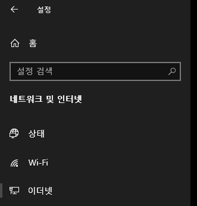
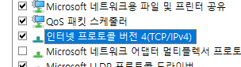
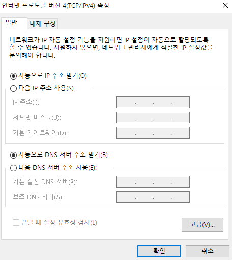

## Introduction

<br>

- PC의 네트워크 어댑터는 기본적으로 DHCP 할당이 되어있으며 웹에 연결이 되어있다.
- 그러나 특정 상황에서는 LAN이 필요한 경우가 있다. (`워크래프트3`, `스타크래프트` 등의 게임, 사무실 내부망 구축 등)
- 아래에서는 LAN 설정을 위해 네트워크 어댑터 세팅을 하는 방법을 알아본다.

<br>

## 1. 제어판 옵션을 통한 변경

<br>

1. `설정` - `네트워크 및 인터넷` - `이더넷` 클릭
    
2. 화면 우측의 `어댑터 옵션 변경` 클릭
    
3. 변경을 원하는 어댑터 더블 클릭 - 좌측 하단의 `속성` 클릭
    
4. `인터넷 프로토콜 버전 4(TCP/IPv4)` 옵션 더블 클릭
    
5. `다음 ~ 주소 사용` 선택 및 주소 입력, `확인` 클릭
    

<br>

## 2. Command prompt 명령어 사용

<br>

1. [1. 제어판 옵션을 통한 변경](#1-제어판-옵션을-통한-변경)의 `1 ~ 2` 항목을 통해 설정을 바꿀 어댑터 이름을 확인한다.
    - 일반적으로 첫번째 유선 어댑터의 이름은 `이더넷`으로, 무선 어댑터의 이름은 `Wi-Fi`로 등록되어 있다.
<br>

2. 아래의 명령어를 Command prompt에 입력해준다.
    - `netsh -c int ip set address "이더넷" static 10.42.0.2 255.255.255.248 0.0.0.0 1`
        - 위 명령어는 `netsh -c int ip set address` `네트워크 어댑터명` `static` `IP 주소` `Subnet mask` `Default gateway` `1` 이다.
<br>

3. 해당 명령어를 `*.bat` 파일로 만드려는 경우, 아래와 같이 만들어준다.
    ```bat
    @echo off
    netsh -c int ip set address "이더넷" static 10.42.0.2 255.255.255.248 0.0.0.0 1
    pause
    ```
    - 위의 명령어 중 `@echo off` 및 `pause`는 취향에 따라 넣어준다.
      - `@echo off`는 프롬프트에 입력되는 명령어를 보이지 않게 한다.
      - `pause`는 모든 작업 실행 후 cmd 창이 자동으로 닫히는 것을 방지한다.