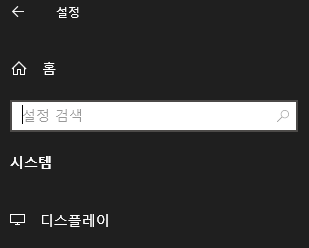
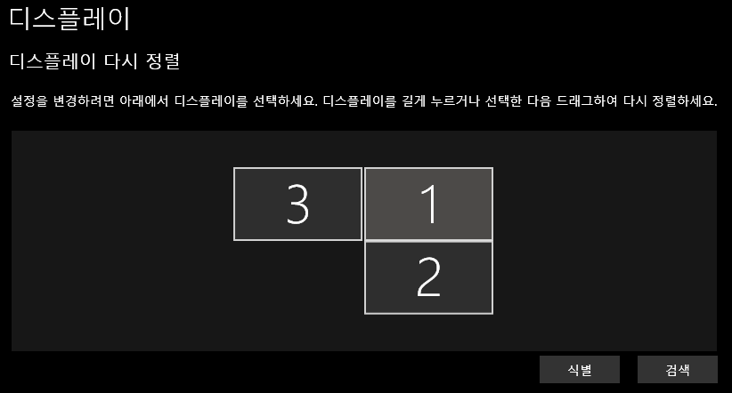
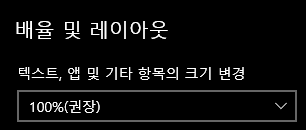

## Introduction

<br>

- 이동식 모니터 등 소형 모니터를 PC로 사용할 때, 윈도우즈 UI 스케일 팩터가 크게 잡혀 너무 크게 보이는 경우가 있다.
- 아래에서는 모니터의 DPI 설정을 바꾸는 방법을 알아본다.

<br>

## 1. 제어판 옵션을 통한 변경

<br>

1. `설정` - `시스템` - `디스플레이` 항목으로 이동한다.
    

2. 설정을 바꿀 디스플레이를 선택한다.
    

3. `배율 및 레이아웃`의 크기 변경 항목을 선택한다. (값이 작을 수록 스케일이 작아진다)
    

<br>

## 2. PowerShell을 통한 변경

<br>

1. PowerShell을 실행한 후, 아래 항목을 실행시켜준다.
    - 아래 항목을 실행할 경우 연결되어 있는 모든 모니터에 같은 값을 입력한다.
    - 아래 스크립트는 모든 모니터의 크기 값을 100%로 바꿔준다.

```powershell
# =========================================================================================================
# if you like to reset your DPI Scaling to the DEFAULT, you can use the registry (Option five) from here:
# https://www.tenforums.com/tutorials/5990-change-dpi-scaling-level-displays-windows-10-a.html#option5
#
# But, since the default value is different on various monitors, if you like to force 100%,
# you need the following trick:
# for each monitor - set DPIValue to 0xFFFFFFFF (which is -1 in DWord)
#
# Last update: 18 December 2018
# Created by: Itsho
# =========================================================================================================


# -1 == 0xFFFFFFFF in DWord == 100% DPI scaling
# 0 = default setting of the screen (can be 125%!)
# 1 = default settings + 1
# 2 = default settings + 2
# Original dpiValue = -1, 일부 소형 모니터에서 기본값이 150%로 잡혀있어 모두 100%로 하기 위해 -2로 바꿈
$dpiValue = -2

$activeMonitorsRegPath = "HKCU:\Control Panel\Desktop\PerMonitorSettings"
$genericMonitorsList = Get-ChildItem HKLM:\System\CurrentControlSet\Control\GraphicsDrivers\ScaleFactors

Write-Host( [string]::Format("Found {0} ScaleFactors monitors", $genericMonitorsList.Length));

foreach ($genericMonitor in $genericMonitorsList) {

  $tempRegPath = $activeMonitorsRegPath + '\' + $genericMonitor.PsChildname;

  # if registry KEY already exists
  if (Test-Path -Path $tempRegPath) {

    Write-Host('Updating value for monitor - ' + $genericMonitor.PsChildname)

    # update existing-item DPI's value
    Set-ItemProperty -Path $tempRegPath -Name 'DpiValue' -Value $dpiValue -Force 

	} else {

    Write-Host('Creating new key and value for monitor - ' + $genericMonitor.PsChildname)

    # create new key under PerMonitorSettings
    New-Item -Path $activeMonitorsRegPath -Name $genericMonitor.PsChildname -Force | Out-Null

    # create new value
    New-ItemProperty  -Path $tempRegPath -Name 'DpiValue' -PropertyType DWord -Value $dpiValue -Force  | Out-Null
	}
}

# Notice - disposing registry objects is mandatory when loading hive of a different user. 
# otherwise you won't be able to unload the hive...
$genericMonitorsList.Close();
$genericMonitorsList = $null;
```