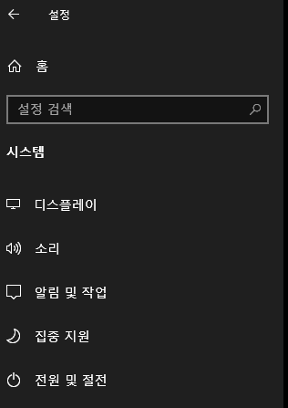
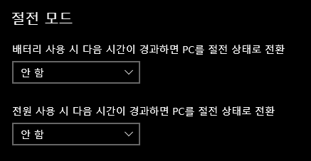
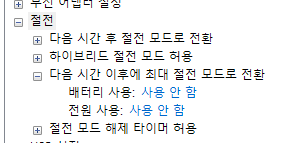

## Introduction

<br>

- Windows에는 많은 전원 설정 항목이 있다.
- 기본 설정으로 사용 시 유휴 상태로 일정 시간이 지나면 차례로 절전 또는 대기모드로 들어가게 되는데, 설정을 통해 이를 방지할 수 있다.
- 이 글에서는 아래 네가지 항목 설정 변경 방법을 알아본다.
    1. 모니터 끄기 방지
    2. 디스크 끄기 방지
    3. 대기모드 진입 방지
    4. 최대 절전 모드 진입 방지

<br>

## 1. 모니터 끄기 방지

<br>

### 1.1. 제어판 옵션을 통한 방법

<br>

1. `설정` - `시스템` - `전원 및 절전` 클릭
    
2. 우측 항목의 `화면` 항목에서 끄기 옵션 `안 함`으로 설정
    

<br>

### 1.2. Command prompt 명령어를 통한 방법

<br>

1. 아래의 두 명령어를 Command prompt에 입력해준다.
    - `powercfg /x monitor-timeout-dc 0`
    - `powercfg /x monitor-timeout-ac 0`
2. 해당 명령어를 `*.bat` 파일로 만드려는 경우, 아래와 같이 만들어준다.
    ```bat
    @echo off
    powercfg /x monitor-timeout-dc 0
    powercfg /x monitor-timeout-ac 0
    pause
    ```
    - 위의 명령어 중 `@echo off` 및 `pause`는 취향에 따라 넣어준다.
      - `@echo off`는 프롬프트에 입력되는 명령어를 보이지 않게 한다.
      - `pause`는 모든 작업 실행 후 cmd 창이 자동으로 닫히는 것을 방지한다.

<br>

## 2. 디스크 끄기 방지

<br>

### 2.1. 제어판 옵션을 통한 방법

<br>

1. `설정` - `시스템` - `전원 및 절전` 클릭
    
2. 화면 우측의 `추가 전원 설정` 클릭
    
3. `선택한 전원 관리 옵션`의 `설정 변경` 클릭
    
4. `고급 전원 관리 옵션 설정 변경` 클릭
    
5. `하드 디스크`항목의 값을 `0`으로 설정 (자동으로 `사용 안 함`으로 변경됨)
    

<br>

### 2.2. Command prompt 명령어를 통한 방법

<br>

1. 아래의 두 명령어를 Command prompt에 입력해준다.
    - `powercfg /x disk-timeout-dc 0`
    - `powercfg /x disk-timeout-ac 0`
2. 해당 명령어를 `*.bat` 파일로 만드려는 경우, 아래와 같이 만들어준다.
    ```bat
    @echo off
    powercfg /x disk-timeout-dc 0
    powercfg /x disk-timeout-ac 0
    pause
    ```
    - 위의 명령어 중 `@echo off` 및 `pause`는 취향에 따라 넣어준다.
      - `@echo off`는 프롬프트에 입력되는 명령어를 보이지 않게 한다.
      - `pause`는 모든 작업 실행 후 cmd 창이 자동으로 닫히는 것을 방지한다.

<br>

## 3. 대기모드 진입 방지

<br>

### 3.1. 제어판 옵션을 통한 방법

<br>

1. `설정` - `시스템` - `전원 및 절전` 클릭
    
2. 우측 항목의 `절전 모드` 항목에서 끄기 옵션 `안 함`으로 설정
    

<br>

### 3.2. Command prompt 명령어를 통한 방법

<br>

1. 아래의 두 명령어를 Command prompt에 입력해준다.
    - `powercfg /x standby-timeout-dc 0`
    - `powercfg /x standby-timeout-ac 0`
2. 해당 명령어를 `*.bat` 파일로 만드려는 경우, 아래와 같이 만들어준다.
    ```bat
    @echo off
    powercfg /x standby-timeout-dc 0
    powercfg /x standby-timeout-ac 0
    pause
    ```
    - 위의 명령어 중 `@echo off` 및 `pause`는 취향에 따라 넣어준다.
      - `@echo off`는 프롬프트에 입력되는 명령어를 보이지 않게 한다.
      - `pause`는 모든 작업 실행 후 cmd 창이 자동으로 닫히는 것을 방지한다.

<br>

## 4. 최대 절전 모드 진입 방지

<br>

### 4.1. 제어판 옵션을 통한 방법

<br>

1. `설정` - `시스템` - `전원 및 절전` 클릭
    
2. 화면 우측의 `추가 전원 설정` 클릭
    
3. `선택한 전원 관리 옵션`의 `설정 변경` 클릭
    
4. `고급 전원 관리 옵션 설정 변경` 클릭
    
5. `절전`항목의 `최대 절전 모드` 값을 `0`으로 설정 (자동으로 `사용 안 함`으로 변경됨)
    

<br>

### 4.2. Command prompt 명령어를 통한 방법

<br>

1. 아래의 명령어를 Command prompt에 입력해준다.
    - `powercfg /hibernate off`
2. 해당 명령어를 `*.bat` 파일로 만드려는 경우, 아래와 같이 만들어준다.
    ```bat
    @echo off
    powercfg /hibernate off
    pause
    ```
    - 위의 명령어 중 `@echo off` 및 `pause`는 취향에 따라 넣어준다.
      - `@echo off`는 프롬프트에 입력되는 명령어를 보이지 않게 한다.
      - `pause`는 모든 작업 실행 후 cmd 창이 자동으로 닫히는 것을 방지한다.